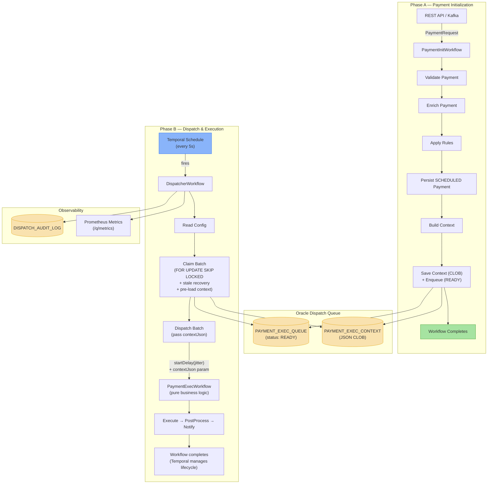
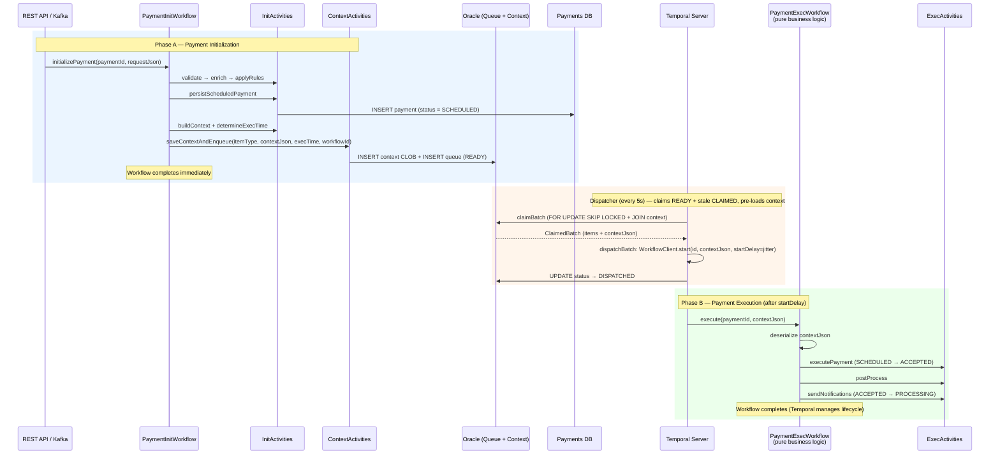
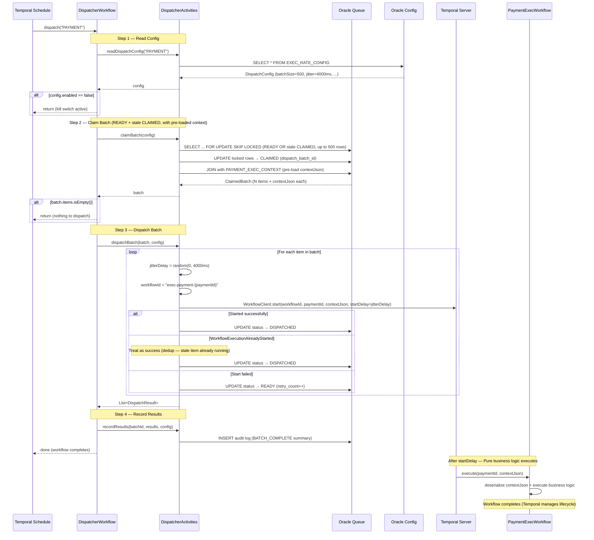
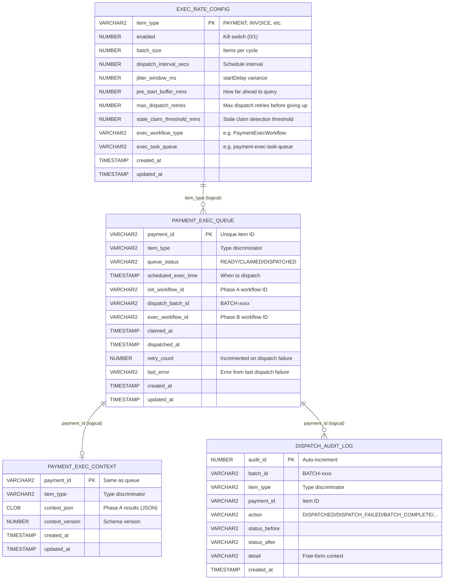
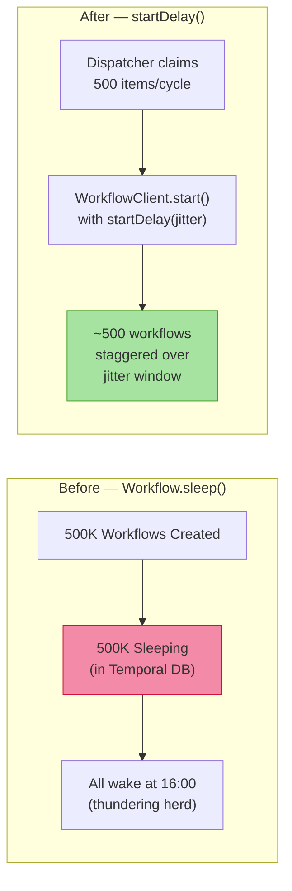

# Rate-Limited Payments Dispatcher System

A two-phase, rate-limited payment processing system built on **Quarkus**, **Temporal**, and **Oracle**. Designed to handle 500K–1M+ daily payments that converge on a single execution window (e.g., 16:00 MST) without overwhelming the Temporal Postgres database.

## Problem

When hundreds of thousands of payments are scheduled for the same execution time, using `Workflow.sleep()` per payment creates that many sleeping workflows in Temporal. This saturates the Temporal Postgres DB (`db.r8g.8xlarge` Aurora) with workflow state, timers, and history rows — causing elevated latency, connection exhaustion, and operational instability.

## Solution

Split the single long-lived workflow into **two short-lived workflows** connected by an **Oracle-based dispatch queue**:

- **Phase A (Init)** — Validate, enrich, apply rules, persist payment as `SCHEDULED`, save context as JSON CLOB, enqueue as `READY`, and **complete immediately** (no sleep).
- **Oracle Queue** — Payments sit in `READY` until their scheduled execution time. The batch claim query pre-loads the Phase A context via JOIN, so exec workflows have zero Oracle dependency.
- **Phase B (Dispatch + Exec)** — A Temporal Schedule fires a dispatcher every 5 seconds. The dispatcher claims batches from Oracle using `FOR UPDATE SKIP LOCKED`, then starts exec workflows with `startDelay()` jitter, passing the pre-loaded `contextJson` as a parameter. Exec workflows are pure business logic with zero framework awareness.

This reduces Temporal DB pressure by **~200x** (from 500K sleeping workflows to ~500 concurrent short-lived ones).

---

## Architecture



---

## End-to-End Lifecycle

This diagram shows the full flow from payment arrival through execution, including both the payment business status and the queue infrastructure status.



### Status Lifecycles

**Queue status** (infrastructure-level, managed by dispatcher):

`READY` → `CLAIMED` → `DISPATCHED` (terminal — Temporal owns it from here)

**Payment status** (business-level, managed by exec workflow):

`SCHEDULED` → `ACCEPTED` → `PROCESSING`

---

## Dispatch Cycle

The dispatcher workflow runs as a short-lived Temporal workflow triggered by a schedule every 5 seconds. Each cycle is a self-contained unit of work. If any step fails, the entire cycle fails gracefully and the next scheduled cycle picks up the work.



---

## Reliability Guarantees

### Deduplication — No Payment Executed Twice

Four independent layers prevent duplicate execution:

| Layer | Mechanism | What It Prevents |
|-------|-----------|------------------|
| **Schedule SKIP** | `ScheduleOverlapPolicy.SKIP` | Two dispatcher workflows running at the same time. The Temporal Schedule will not fire a new dispatcher cycle if the previous one is still running. |
| **Oracle SKIP LOCKED** | `SELECT ... FOR UPDATE SKIP LOCKED` | Two dispatcher instances claiming the same row. Each dispatcher transaction locks its own disjoint set of rows; any rows already locked by another transaction are silently skipped. |
| **Deterministic Workflow ID** | `exec-{itemType}-{itemId}` | Two exec workflows for the same payment. Temporal enforces workflow ID uniqueness — attempting to start a workflow with an already-running ID throws `WorkflowExecutionAlreadyStarted`, which the dispatcher catches and treats as success. |
| **Status Guards** | `WHERE queue_status = 'CLAIMED'` | Out-of-order status transitions. Every `UPDATE` that changes queue status includes a `WHERE` clause asserting the expected current status. For example, `markDispatched()` requires `queue_status = 'CLAIMED'` — if another dispatcher already moved the row to `DISPATCHED`, the UPDATE affects zero rows and the dispatcher logs a warning. This prevents a slow dispatcher from overwriting a status that has already advanced. |

### Completeness — No Payment Left Behind

Every payment that enters the system is guaranteed to eventually reach `DISPATCHED` (at which point Temporal owns the execution lifecycle):

- **Enqueue is retried by Temporal.** The `saveContextAndEnqueue` method is a single Temporal activity. If the enqueue step fails (e.g., Oracle is momentarily down), Temporal automatically retries the entire activity. Context save is idempotent (insert-first with duplicate-key fallback), so retries are safe. A payment cannot be "lost" before entering the queue.

- **READY items are picked up by the next cycle.** The dispatcher runs every 5 seconds. Any `READY` item whose `scheduled_exec_time` has arrived and whose `retry_count < max_dispatch_retries` will be claimed. Items are never skipped as long as the dispatcher is running and the kill switch is not active.

- **Stale CLAIMED items self-heal.** If the dispatcher JVM crashes after claiming a batch but before dispatching, those items are stuck in `CLAIMED`. The unified claim query includes an OR predicate that picks up `CLAIMED` rows whose `claimed_at` exceeds the configured threshold (default: 2 minutes). These stale items are re-claimed and re-dispatched in a subsequent cycle — no manual intervention required.

- **Failed dispatches retry automatically.** If `WorkflowClient.start()` fails for a specific item (e.g., Temporal is temporarily unreachable), the item is immediately reset to `READY` with `retry_count++`. It will be picked up in the next cycle, up to `max_dispatch_retries` attempts.

- **DISPATCHED is terminal for the queue.** Once an item reaches `DISPATCHED`, Temporal's built-in retry and timeout policies govern the exec workflow's lifecycle. The Oracle queue is no longer involved.

### Failure Recovery

| Failure Scenario | What Happens | Recovery |
|-----------------|--------------|----------|
| **Dispatcher crashes after claiming batch** | Items stuck in `CLAIMED` with stale `claimed_at` | Next cycle's unified claim query picks up `CLAIMED` rows older than threshold (default 2 min). Re-dispatched automatically. If the exec workflow was already started, `WorkflowExecutionAlreadyStarted` is caught and treated as success. |
| **`WorkflowClient.start()` fails for an item** | Item cannot be dispatched to Temporal | Item immediately reset to `READY` with `retry_count++`. Retried in next cycle. |
| **Exec workflow fails after DISPATCHED** | Business logic error during execution | Temporal manages retries, timeouts, and failure. Queue stays at `DISPATCHED` — no callback to Oracle needed. |
| **Context pre-load fails during claimBatch** | The entire batch claim activity fails | Items remain `CLAIMED` → picked up as stale in the next cycle after threshold expires. |
| **Oracle temporarily down** | Dispatcher activity fails | Temporal does not retry (maxAttempts=1). Next scheduled cycle (5s later) will attempt again. |

---

## Oracle Schema



> **Note:** No foreign keys are used. Referential integrity is enforced at the application level. This avoids FK lock contention under high-throughput batch operations.

### Key Indexes

| Index | Columns | Purpose |
|-------|---------|---------|
| `idx_peq_dispatch` | `(item_type, queue_status, scheduled_exec_time, retry_count)` | Unified claim query — READY items predicate |
| `idx_peq_stale_claims` | `(item_type, queue_status, claimed_at)` | Unified claim query — stale CLAIMED predicate |
| `idx_peq_batch` | `(dispatch_batch_id)` | Post-claim batch lookup |

### Unified Claim Query

Raw JDBC is used because Kotlin Exposed DSL only provides `ForUpdateOption.PostgreSQL` — there is no Oracle-specific variant.

```sql
SELECT payment_id FROM PAYMENT_EXEC_QUEUE
WHERE item_type = ?
  AND (
    (queue_status = 'READY' AND scheduled_exec_time <= ? AND retry_count < ?)
    OR
    (queue_status = 'CLAIMED' AND claimed_at <= ?)
  )
ORDER BY scheduled_exec_time ASC
FETCH FIRST ? ROWS ONLY
FOR UPDATE SKIP LOCKED
```

The OR predicate unifies normal dispatch (READY items) and stale recovery (old CLAIMED items) into a single Oracle round-trip.

---

## Key Design Decisions

### `startDelay()` Instead of `Workflow.sleep()`



- **No sleeping workflows** — payments wait in Oracle `READY` status, not in Temporal
- **Controlled throughput** — dispatcher starts ~500 workflows per 5-second cycle
- **Jitter** — `startDelay(random(0, 4000ms))` spreads execution starts, preventing thundering herd

### Insert-First Context Persistence

Instead of Exposed's `upsert()` (which generates Oracle `MERGE`), context saves use `insert()` with duplicate-key fallback. This optimizes for the common path (first insert), is idempotent on Temporal activity retries, and avoids MERGE overhead.

### Composition Over Inheritance

The framework layer is generic and reusable. Payment-specific implementations compose framework helpers — no inheritance required. Exec workflows are pure business logic with zero framework awareness. To add a new domain (e.g., invoices): insert a config row, create an exec workflow, implement `SchedulableContextActivities`, and compose `ScheduleLifecycle` in the init workflow. No changes to the framework layer.

---

## Capacity Math

| Metric | Before (sleep-based) | After (dispatch queue) | Basis |
|--------|---------------------|----------------------|-------|
| Sleeping workflows | 500,000 | 0 | Before: one `Workflow.sleep()` per payment. After: payments wait in Oracle `READY` status — zero Temporal state. |
| Concurrent workflows | 500,000 | ~500 per cycle | After: `batchSize=500` items claimed per 5-second cycle. Only those ~500 exec workflows are active at any given time (each completes in seconds). |
| Temporal DB rows (active) | ~2,000,000 | ~10,000 | Before: each sleeping workflow has ~4 active DB rows (workflow row, run row, timer task, history shard). 500K × 4 ≈ 2M rows. After: ~500 concurrent exec workflows × 4 rows + ~500 dispatcher/init workflows × 4 rows ≈ 4,000–10,000 active rows. |
| DB pressure factor | 1x | ~0.005x (200x reduction) | Ratio of active Temporal DB rows: 10,000 / 2,000,000 = 0.005. |
| Dispatch latency | All at once (thundering herd) | Staggered over jitter window | Before: all 500K workflows wake at the same timestamp. After: 500 per cycle × 5s interval, with 0–4s jitter within each batch. Full 500K dispatched over ~83 minutes (500K / 500 × 5s / 60). |

---

## Project Structure

```
payment-dispatch/
├── build.gradle.kts                          # Gradle build (Quarkus + Temporal + Exposed)
├── settings.gradle.kts                       # Project settings
├── gradle.properties                         # Version pinning
│
└── src/main/
    ├── resources/
    │   ├── application.yaml                  # Quarkus config (Temporal, Oracle, metrics)
    │   └── db/migration/
    │       └── V1__create_dispatch_tables.sql # Oracle DDL (4 tables, indexes, seed data)
    │
    └── kotlin/com/payment/dispatcher/
        │
        ├── config/
        │   ├── AppConfig.kt                  # @ConfigMapping for dispatch settings
        │   ├── TemporalConfig.kt             # Temporal client + worker configuration
        │   ├── WorkerConfig.kt               # Worker registration and task queue setup
        │   └── DispatchScheduleInitializer.kt # Creates Temporal Schedule on startup
        │
        ├── framework/                        # ── Generic Dispatch Infrastructure ──
        │   ├── model/
        │   │   ├── QueueStatus.kt            # READY/CLAIMED/DISPATCHED
        │   │   ├── DispatchConfig.kt         # Runtime config loaded from EXEC_RATE_CONFIG
        │   │   ├── ClaimedBatch.kt           # Batch claim result (batchId + items)
        │   │   └── DispatchResult.kt         # Per-item dispatch result
        │   │
        │   ├── repository/
        │   │   ├── tables/                   # Exposed table definitions (4 tables)
        │   │   ├── DispatchQueueRepository.kt    # Core queue ops (unified claim, status transitions)
        │   │   ├── DispatchConfigRepository.kt   # Config reader
        │   │   └── DispatchAuditRepository.kt    # Insert-only audit log
        │   │
        │   ├── context/
        │   │   ├── ExecutionContextService.kt    # Generic context interface
        │   │   └── ExposedContextService.kt      # Insert-first + Jackson implementation
        │   │
        │   ├── activity/
        │   │   ├── DispatcherActivities.kt       # @ActivityInterface (4 methods)
        │   │   ├── DispatcherActivitiesImpl.kt   # Core dispatch logic
        │   │   └── SchedulableContextActivities.kt # @ActivityInterface for context + enqueue
        │   │
        │   ├── workflow/
        │   │   ├── ScheduleLifecycle.kt           # Composable lifecycle helper for Phase A
        │   │   ├── DispatcherWorkflow.kt         # @WorkflowInterface
        │   │   └── DispatcherWorkflowImpl.kt     # 4-step dispatch cycle
        │   │
        │   ├── schedule/
        │   │   └── DispatchScheduleSetup.kt      # Temporal Schedule creation
        │   │
        │   ├── config/
        │   │   └── ExposedDatabaseConfig.kt      # Exposed ↔ Agroal bridge
        │   │
        │   └── metrics/
        │       └── DispatchMetrics.kt            # Micrometer counters + timers
        │
        └── payment/                          # ── Payment-Specific Implementation ──
            ├── model/
            │   ├── PaymentRequest.kt             # Inbound DTO
            │   ├── PaymentExecContext.kt          # Phase A accumulated context
            │   └── PaymentStatus.kt              # SCHEDULED / ACCEPTED / PROCESSING
            │
            ├── context/
            │   └── PaymentContextActivitiesImpl.kt # Implements SchedulableContextActivities
            │
            ├── init/                             # Phase A
            │   ├── PaymentInitWorkflow.kt        # @WorkflowInterface
            │   ├── PaymentInitWorkflowImpl.kt    # Validate → Enrich → Rules → Persist → Enqueue
            │   ├── PaymentInitActivities.kt      # @ActivityInterface
            │   └── PaymentInitActivitiesImpl.kt  # Business logic stubs
            │
            └── exec/                             # Phase B
                ├── PaymentExecWorkflow.kt        # @WorkflowInterface
                ├── PaymentExecWorkflowImpl.kt    # Pure business logic (zero framework awareness)
                ├── PaymentExecActivities.kt      # @ActivityInterface
                └── PaymentExecActivitiesImpl.kt  # Business logic stubs
```

---

## Temporal Workers

Three dedicated workers with isolated task queues:

| Worker | Task Queue | Workflows | Activities | Concurrency |
|--------|-----------|-----------|------------|-------------|
| **dispatch-worker** | `dispatch-task-queue` | DispatcherWorkflow | DispatcherActivities | 5 WF / 10 Act |
| **payment-init-worker** | `payment-init-task-queue` | PaymentInitWorkflow | PaymentInitActivities, SchedulableContextActivities | 100 WF / 200 Act |
| **payment-exec-worker** | `payment-exec-task-queue` | PaymentExecWorkflow | PaymentExecActivities | 100 WF / 200 Act |

---

## Metrics & Alerting

Exported via Micrometer to Prometheus at `/q/metrics`.

| Metric | Type | Description |
|--------|------|-------------|
| `dispatch.batch.claimed` | Counter | Total items claimed across all batches |
| `dispatch.workflow.started` | Counter | Exec workflows successfully started |
| `dispatch.workflow.start.failures` | Counter | Exec workflow start failures |
| `dispatch.cycle.duration` | Timer | Full dispatch cycle duration (seconds) |

### Recommended Alerts

| Alert | Condition | Severity |
|-------|-----------|----------|
| Queue depth high | `dispatch.queue.depth{status="READY"} > 10000` for 5m | Warning |
| Dispatch failures spike | `rate(dispatch.workflow.start.failures[5m]) > 5` for 2m | Critical |

---

## Runtime Configuration

All dispatch parameters are stored in `EXEC_RATE_CONFIG` and read each cycle — **no redeploy needed**.

```sql
-- Tune batch size (takes effect within 5 seconds)
UPDATE EXEC_RATE_CONFIG SET batch_size = 1000 WHERE item_type = 'PAYMENT';

-- Kill switch (items remain READY, not lost)
UPDATE EXEC_RATE_CONFIG SET enabled = 0 WHERE item_type = 'PAYMENT';

-- Adjust jitter window
UPDATE EXEC_RATE_CONFIG SET jitter_window_ms = 8000 WHERE item_type = 'PAYMENT';
```

---

## Tech Stack

| Component | Version | Purpose |
|-----------|---------|---------|
| **Kotlin** | 2.1.0 | Language (JVM 21) |
| **Quarkus** | 3.29.4 | Application framework (CDI, REST, health, config) |
| **Temporal SDK** | 1.31.0 | Workflow orchestration |
| **Kotlin Exposed** | 0.61.0 | Type-safe SQL DSL (Oracle) |
| **Oracle** | — | Dispatch queue, context persistence, config, audit |
| **Agroal** | (Quarkus-managed) | Oracle connection pooling (5–20 connections) |
| **Micrometer + Prometheus** | (Quarkus-managed) | Metrics export |
| **Jackson** | (Quarkus-managed) | JSON serialization (Kotlin module) |

---

## Getting Started

### Prerequisites

- JDK 21+
- Oracle database (or Oracle XE for local dev)
- Temporal Server (local or remote)
- Gradle 8.11.1

### Build

```bash
./gradlew build
```

### Run Database Migration

```bash
sqlplus dispatch_user/dispatch_pass@//localhost:1521/XEPDB1 @src/main/resources/db/migration/V1__create_dispatch_tables.sql
```

### Run

```bash
./gradlew quarkusDev
```

### Environment Variables

| Variable | Default | Description |
|----------|---------|-------------|
| `TEMPORAL_TARGET` | `localhost:7233` | Temporal gRPC endpoint |
| `TEMPORAL_NAMESPACE` | `default` | Temporal namespace |
| `ORACLE_USER` | `dispatch_user` | Oracle username |
| `ORACLE_PASSWORD` | `dispatch_pass` | Oracle password |
| `ORACLE_JDBC_URL` | `jdbc:oracle:thin:@//localhost:1521/XEPDB1` | Oracle JDBC URL |
