# Rate-Limited Payment Dispatch System

A two-phase, rate-limited payment processing system built on **Quarkus**, **Temporal**, and **Oracle**. Designed to handle 500K–1M+ daily payments that converge on a single execution window (e.g., 16:00 MST) without overwhelming the Temporal Postgres database.

## Problem

When hundreds of thousands of payments are scheduled for the same execution time, using `Workflow.sleep()` per payment creates that many sleeping workflows in Temporal. This saturates the Temporal Postgres DB (`db.r8g.8xlarge` Aurora) with workflow state, timers, and history rows — causing elevated latency, connection exhaustion, and operational instability.

## Solution

Split the single long-lived workflow into **two short-lived workflows** connected by an **Oracle-based dispatch queue**:

- **Phase A** — Validate, enrich, apply rules, persist payment as SCHEDULED, save context, enqueue, and **complete immediately** (no sleep).
- **Phase B** — A Temporal Schedule fires a dispatcher every N seconds. The dispatcher claims batches from Oracle using `FOR UPDATE SKIP LOCKED`, then starts execution workflows with `startDelay()` jitter.

This reduces Temporal DB pressure by **~200x** (from 500K sleeping workflows to ~500 concurrent short-lived ones).

---

## Architecture

**Phase A (Payment Initialization)**

- Validates, enriches, and applies rules to the payment
- Persists the payment in the payments DB with `SCHEDULED` status
- Serializes all accumulated results as a JSON CLOB context
- Enqueues the payment in the dispatch queue with `READY` status
- Workflow completes immediately — no sleeping workflows

**Oracle Dispatch Queue**

- Buffer between phases — payments sit in `READY` until their scheduled execution time
- Concurrent dispatchers via `FOR UPDATE SKIP LOCKED`
- Built-in retry tracking with dead-letter protection
- Stores Phase A context as JSON CLOB (no work repeated in Phase B)

**Phase B (Dispatch & Execution)**

- Temporal Schedule fires `DispatcherWorkflow` every 5 seconds
- Each cycle: read config (kill switch) → recover stale claims → claim batch → dispatch → record results
- Batch claim JOINs with context table to **pre-load JSON CLOB** — no separate Oracle round-trip per execution
- Exec workflows started with `startDelay()` jitter to prevent thundering herd
- Exec workflows are pure business logic with zero dispatch framework awareness — they receive `contextJson` as a parameter, deserialize it, and execute. The dispatcher manages queue status externally
- Payment transitions: `SCHEDULED` → `ACCEPTED` → `PROCESSING`

**Observability**

- Insert-only audit log in Oracle (dispatches, failures, stale recoveries)
- Prometheus metrics via Micrometer (batch claimed, workflow starts, failures, stale recoveries, dead letters, cycle duration)

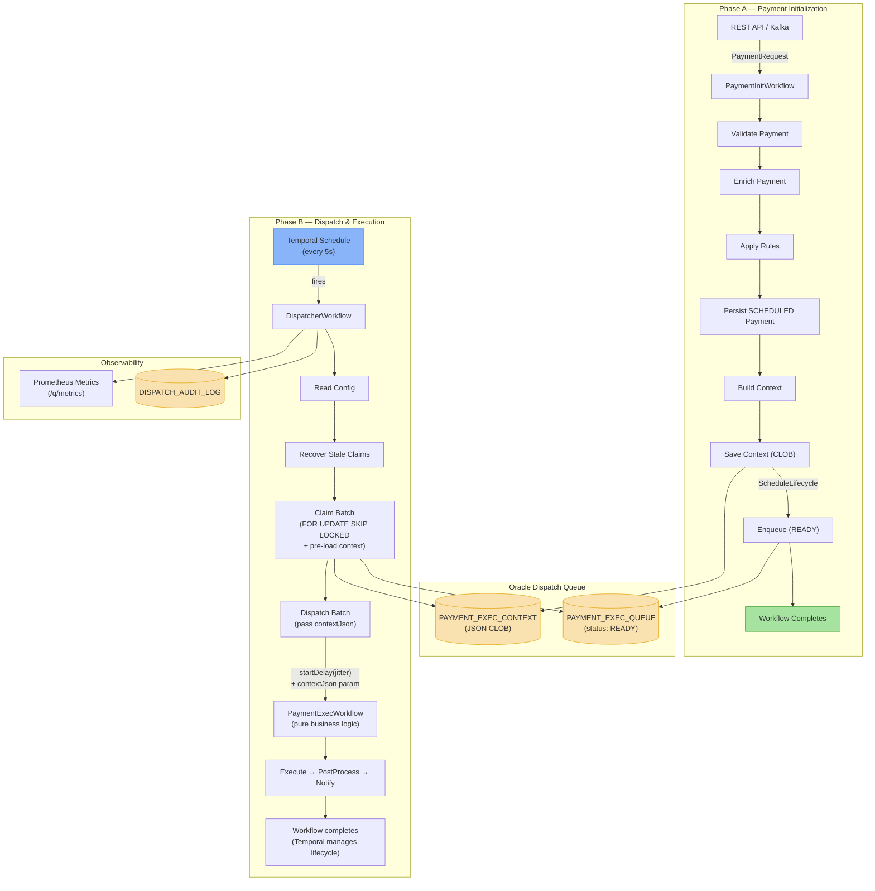

---

## Payment Lifecycle — End-to-End Sequence Diagram

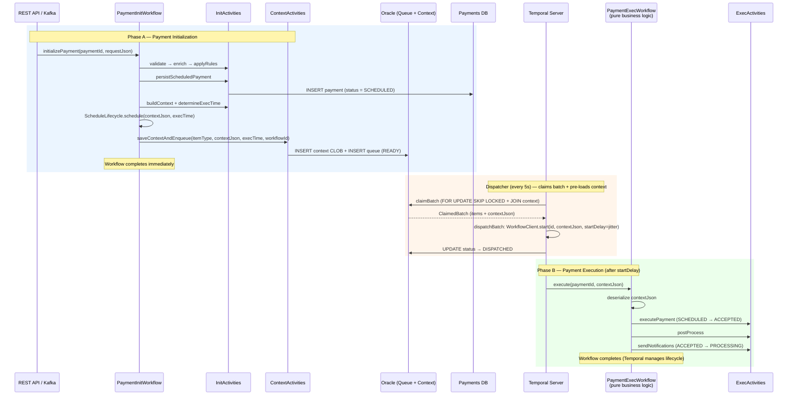

---

## Dispatch Cycle — Sequence Diagram

The dispatcher workflow runs as a short-lived Temporal workflow triggered by a schedule every 5 seconds. Each cycle is a self-contained unit of work: read config, self-heal stale claims, claim a batch, dispatch, and record results. If any step fails, the entire cycle fails gracefully and the next scheduled cycle picks up the work.

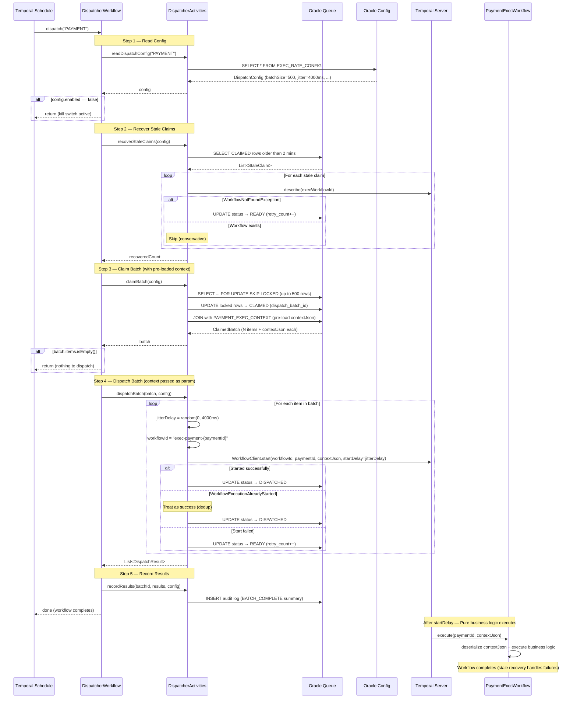

---

## Payment Status — State Diagram

The payment has its own business-level status lifecycle, tracked in the payments database. This is separate from the dispatch queue status and represents the payment's progress through the business process.

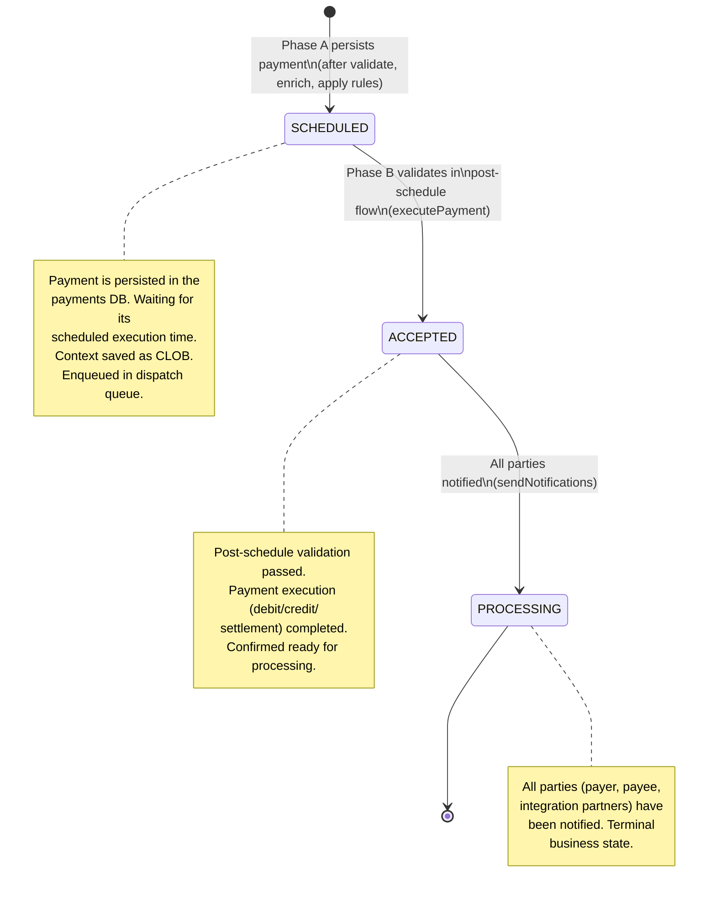

---

## Queue Status — State Diagram

The dispatch queue has its own infrastructure-level status lifecycle for managing the dispatch process. This is an internal mechanism and is separate from the payment's business status above.

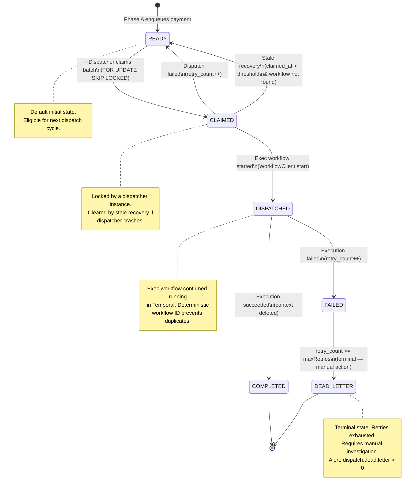

---

## Combined Status Flow — Payment & Queue

This diagram shows how the payment status and queue status flow together across both phases, from initial request through to completed processing.

```mermaid
graph LR
    subgraph "Phase A (Init Workflow)"
        A1["Validate"] --> A2["Enrich"]
        A2 --> A3["Apply Rules"]
        A3 --> A4["Persist Payment\n(SCHEDULED)"]
        A4 --> A5["Save Context\n+ Enqueue (READY)"]
    end

    subgraph "Dispatch Queue"
        A5 --> Q1["READY"]
        Q1 --> Q2["CLAIMED\n(context pre-loaded)"]
        Q2 --> Q3["DISPATCHED\n(contextJson passed)"]
    end

    subgraph "Phase B (Exec Workflow)"
        Q3 --> B1["Execute Payment\n(SCHEDULED → ACCEPTED)"]
        B1 --> B2["Post-Process"]
        B2 --> B3["Send Notifications\n(ACCEPTED → PROCESSING)"]
        B3 --> Q4["COMPLETED"]
    end

    style A4 fill:#89b4fa,stroke:#1e66f5
    style B1 fill:#a6e3a1,stroke:#40a02b
    style B3 fill:#a6e3a1,stroke:#40a02b
    style Q1 fill:#f9e2af,stroke:#e6a817
    style Q2 fill:#f9e2af,stroke:#e6a817
    style Q3 fill:#f9e2af,stroke:#e6a817
    style Q4 fill:#f9e2af,stroke:#e6a817
```

---

## Phase A — Payment Initialization State Diagram

Phase A runs as a short-lived Temporal workflow. It validates, enriches, applies rules, persists the payment as `SCHEDULED`, builds the accumulated context, saves it to Oracle, and enqueues the payment for dispatch. The workflow completes immediately — no sleeping.

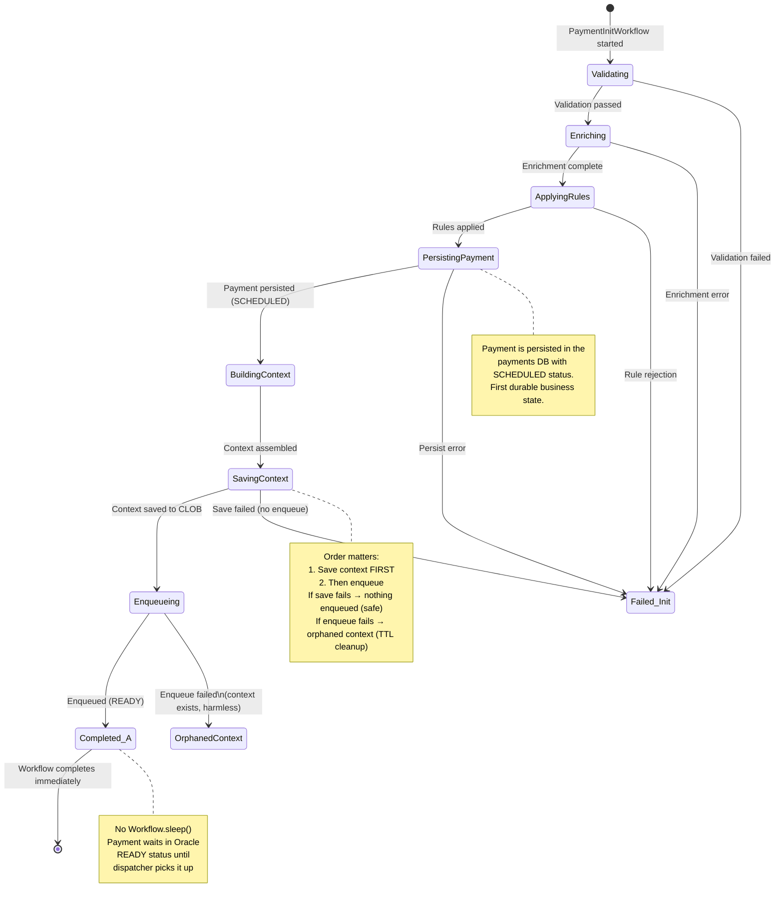

---

## Deduplication Protection Layers

The system implements four layers of duplicate dispatch prevention to ensure every payment is executed exactly once, even under concurrent dispatchers, network failures, and Temporal retries.

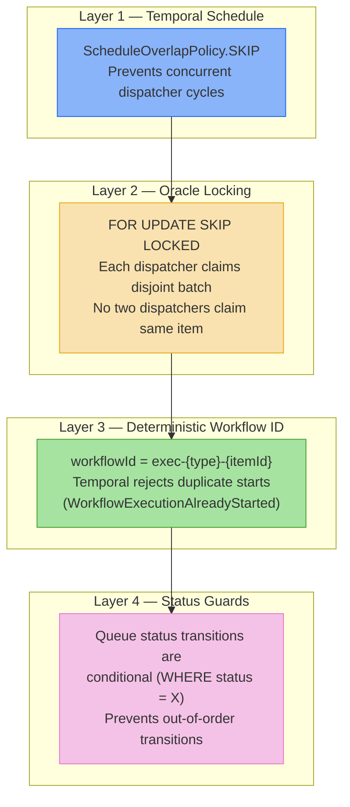

| Layer | Mechanism | Prevents |
|-------|-----------|----------|
| **Schedule SKIP** | `ScheduleOverlapPolicy.SCHEDULE_OVERLAP_POLICY_SKIP` | Concurrent dispatcher workflows |
| **SKIP LOCKED** | `SELECT ... FOR UPDATE SKIP LOCKED` | Two dispatchers claiming same row |
| **Deterministic ID** | `exec-{itemType}-{itemId}` | Duplicate exec workflow starts |
| **Status Guards** | `WHERE queue_status = 'CLAIMED'` | Out-of-order status transitions |

---

## Oracle Schema

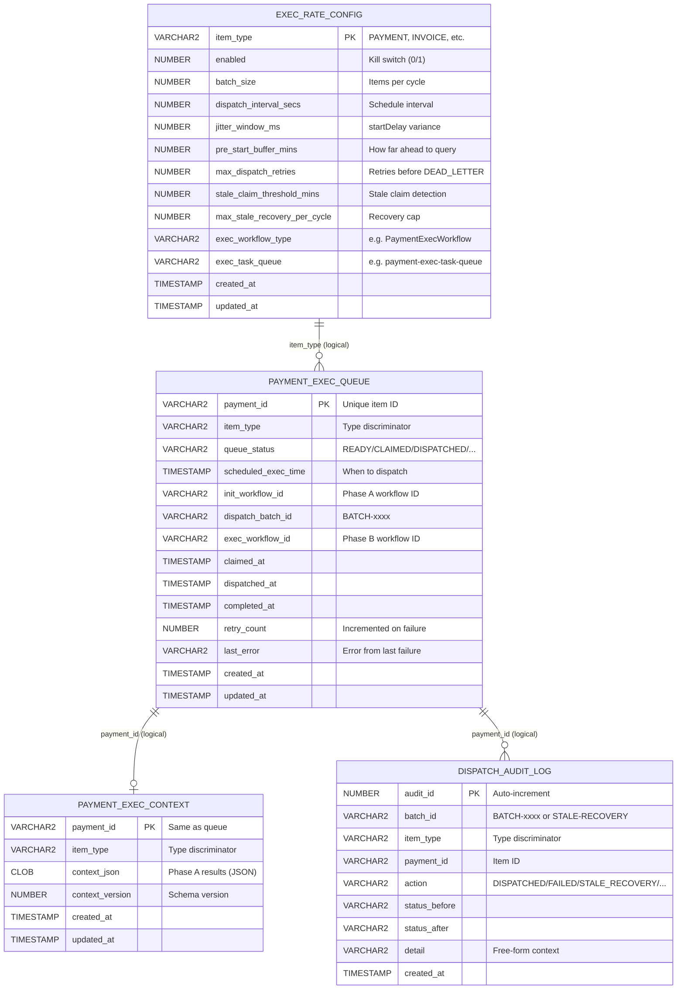

> **Note:** No foreign keys are used. Referential integrity is enforced at the application level. This avoids FK lock contention under high-throughput batch operations.

### Key Indexes

| Index | Columns | Purpose |
|-------|---------|---------|
| `idx_peq_dispatch` | `(item_type, queue_status, scheduled_exec_time, retry_count)` | `claimBatch` — high-frequency dispatcher query |
| `idx_peq_stale_claims` | `(item_type, queue_status, claimed_at)` | Stale recovery query |
| `idx_peq_batch` | `(dispatch_batch_id)` | Post-claim batch lookup |

---

## Project Structure

```
payment-dispatch/
├── build.gradle.kts                          # Gradle build (Quarkus + Temporal + Exposed)
├── settings.gradle.kts                       # Project settings
├── gradle.properties                         # Version pinning
│
└── src/main/
    ├── resources/
    │   ├── application.yaml                  # Quarkus config (Temporal, Oracle, metrics)
    │   └── db/migration/
    │       └── V1__create_dispatch_tables.sql # Oracle DDL (4 tables, indexes, seed data)
    │
    └── kotlin/com/payment/dispatcher/
        │
        ├── config/
        │   ├── AppConfig.kt                  # @ConfigMapping for dispatch settings
        │   ├── TemporalConfig.kt             # Temporal client + worker configuration
        │   ├── WorkerConfig.kt               # Worker registration and task queue setup
        │   └── DispatchScheduleInitializer.kt # Creates Temporal Schedule on startup
        │
        ├── framework/                        # ── Generic Dispatch Infrastructure ──
        │   ├── model/
        │   │   ├── QueueStatus.kt            # READY/CLAIMED/DISPATCHED/COMPLETED/FAILED/DEAD_LETTER
        │   │   ├── DispatchConfig.kt         # Runtime config loaded from EXEC_RATE_CONFIG
        │   │   ├── ClaimedBatch.kt           # Batch claim result (batchId + items)
        │   │   └── DispatchResult.kt         # Per-item dispatch result
        │   │
        │   ├── repository/
        │   │   ├── tables/
        │   │   │   ├── ExecRateConfigTable.kt    # Exposed table: EXEC_RATE_CONFIG
        │   │   │   ├── ExecQueueTable.kt         # Exposed table: PAYMENT_EXEC_QUEUE
        │   │   │   ├── ExecContextTable.kt       # Exposed table: PAYMENT_EXEC_CONTEXT
        │   │   │   └── DispatchAuditLogTable.kt  # Exposed table: DISPATCH_AUDIT_LOG
        │   │   │
        │   │   ├── DispatchQueueRepository.kt    # Core queue ops (claim, status, stale recovery)
        │   │   ├── DispatchConfigRepository.kt   # Config reader
        │   │   └── DispatchAuditRepository.kt    # Insert-only audit log
        │   │
        │   ├── context/
        │   │   ├── ExecutionContextService.kt    # Generic context interface
        │   │   └── ExposedContextService.kt      # Exposed + Jackson implementation
        │   │
        │   ├── activity/
        │   │   ├── DispatcherActivities.kt       # @ActivityInterface (5 methods)
        │   │   ├── DispatcherActivitiesImpl.kt   # Core dispatch logic
        │   │   └── SchedulableContextActivities.kt # @ActivityInterface for context + enqueue
        │   │
        │   ├── workflow/
        │   │   ├── ScheduleLifecycle.kt           # Composable lifecycle helper
        │   │   ├── DispatcherWorkflow.kt         # @WorkflowInterface
        │   │   └── DispatcherWorkflowImpl.kt     # 5-step dispatch cycle
        │   │
        │   ├── schedule/
        │   │   └── DispatchScheduleSetup.kt      # Temporal Schedule creation
        │   │
        │   ├── config/
        │   │   └── ExposedDatabaseConfig.kt      # Exposed ↔ Agroal bridge
        │   │
        │   └── metrics/
        │       └── DispatchMetrics.kt            # Micrometer counters + timers
        │
        └── payment/                          # ── Payment-Specific Implementation ──
            ├── model/
            │   ├── PaymentRequest.kt             # Inbound DTO
            │   ├── PaymentExecContext.kt          # Phase A accumulated context
            │   └── PaymentStatus.kt              # SCHEDULED / ACCEPTED / PROCESSING
            │
            ├── context/
            │   └── PaymentContextActivitiesImpl.kt # Implements SchedulableContextActivities
            │
            ├── init/                             # Phase A
            │   ├── PaymentInitWorkflow.kt        # @WorkflowInterface
            │   ├── PaymentInitWorkflowImpl.kt    # Validate → Enrich → Rules → Persist → Enqueue
            │   ├── PaymentInitActivities.kt      # @ActivityInterface
            │   └── PaymentInitActivitiesImpl.kt  # Business logic stubs
            │
            └── exec/                             # Phase B
                ├── PaymentExecWorkflow.kt        # @WorkflowInterface
                ├── PaymentExecWorkflowImpl.kt    # Pure business logic (zero framework awareness)
                ├── PaymentExecActivities.kt      # @ActivityInterface
                └── PaymentExecActivitiesImpl.kt  # Business logic stubs
```

---

## Key Design Decisions

### `startDelay()` Instead of `Workflow.sleep()`

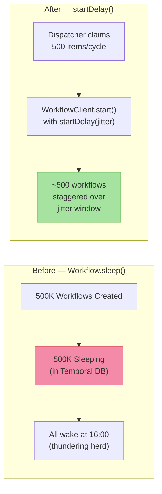

- **No sleeping workflows** — payments wait in Oracle `READY` status, not in Temporal
- **Controlled throughput** — dispatcher starts ~500 workflows per 5-second cycle
- **Jitter** — `startDelay(random(0, 4000ms))` spreads execution starts, preventing thundering herd
- **~200x reduction** in Temporal DB pressure

### Oracle `FOR UPDATE SKIP LOCKED`

Raw JDBC is used for the batch claim operation because Kotlin Exposed DSL only provides `ForUpdateOption.PostgreSQL` — there is no Oracle-specific variant.

```sql
SELECT payment_id FROM PAYMENT_EXEC_QUEUE
WHERE item_type = ?
  AND queue_status = 'READY'
  AND scheduled_exec_time <= ?
  AND retry_count < ?
ORDER BY scheduled_exec_time ASC
FETCH FIRST ? ROWS ONLY
FOR UPDATE SKIP LOCKED
```

- **Contention-free** — multiple dispatcher instances can run concurrently
- **Non-blocking** — `SKIP LOCKED` skips rows locked by other transactions
- **Atomic** — SELECT + UPDATE within the same JDBC transaction

### Insert-First Context Persistence

Instead of Exposed's `upsert()` (which generates Oracle `MERGE`), context saves use `insert()` with duplicate-key fallback:

```kotlin
try {
    ExecContextTable.insert { ... }
} catch (e: ExposedSQLException) {
    if (isUniqueViolation) {
        ExecContextTable.update({ ... }) { ... }
    } else throw e
}
```

- **Lower overhead** — avoids MERGE on every save
- **Idempotent** — safe on Temporal activity retries
- **Common path optimized** — first insert is a simple INSERT (majority case)

### Context Pre-loading at Dispatch Time

Instead of having each execution workflow load its context from Oracle as its first activity, context is **pre-loaded during the batch claim** and passed as a JSON string parameter to the exec workflow:

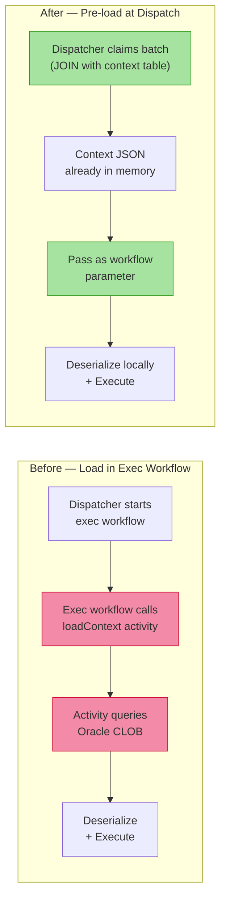

- **Eliminates N Oracle round-trips** — context for all 500 items in a batch is loaded in a single JOIN query during `claimBatch`
- **Simpler exec workflow** — no `loadContext` activity, no Oracle dependency at execution time
- **One fewer failure mode** — if context load failed before, the exec workflow would be stuck in CLAIMED; now the context is guaranteed available at workflow start
- **Context is immutable** — Phase A output doesn't change after enqueueing, so pre-loading introduces no staleness risk

### Composition via Lifecycle Helpers

The framework layer is generic and reusable. Payment-specific implementations compose framework helpers — no inheritance required. Exec workflows are pure business logic with zero framework awareness:

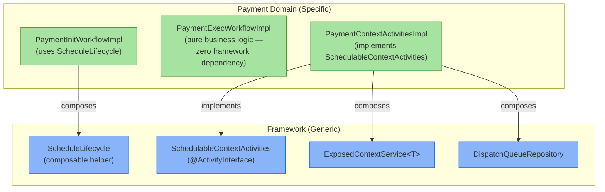

To add a new domain (e.g., invoices):
1. Insert config row in `EXEC_RATE_CONFIG` (`item_type='INVOICE'`)
2. Create `InvoiceExecContext`, `InvoiceInitWorkflow` (compose `ScheduleLifecycle` in init workflow)
3. Create `InvoiceExecWorkflowImpl` — pure business logic, receives `contextJson`, no framework dependency
4. Create `InvoiceContextActivitiesImpl` implementing `SchedulableContextActivities`
5. No changes to the framework layer

---

## Failure Recovery

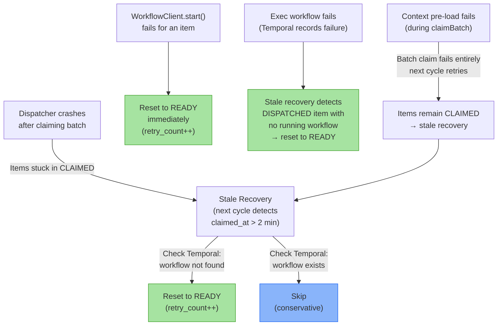

---

## Temporal Workers

Three dedicated workers with isolated task queues:

| Worker | Task Queue | Workflows | Activities | Concurrency |
|--------|-----------|-----------|------------|-------------|
| **dispatch-worker** | `dispatch-task-queue` | DispatcherWorkflow | DispatcherActivities | 5 WF / 10 Act |
| **payment-init-worker** | `payment-init-task-queue` | PaymentInitWorkflow | PaymentInitActivities, SchedulableContextActivities | 100 WF / 200 Act |
| **payment-exec-worker** | `payment-exec-task-queue` | PaymentExecWorkflow | PaymentExecActivities | 100 WF / 200 Act |

---

## Metrics & Alerting

Exported via Micrometer to Prometheus at `/q/metrics`.

### Counters

| Metric | Description |
|--------|-------------|
| `dispatch.batch.claimed` | Total items claimed across all batches |
| `dispatch.workflow.started` | Exec workflows successfully started |
| `dispatch.workflow.start.failures` | Exec workflow start failures |
| `dispatch.stale.recovered` | Stale claims recovered to READY |
| `dispatch.dead.letter` | Items moved to DEAD_LETTER |

### Timers

| Metric | Description |
|--------|-------------|
| `dispatch.cycle.duration` | Full dispatch cycle duration (seconds) |

### Recommended Alerts

| Alert | Condition | Severity |
|-------|-----------|----------|
| Queue depth high | `dispatch.queue.depth{status="READY"} > 10000` for 5m | Warning |
| Dead letters appearing | `rate(dispatch.dead.letter[5m]) > 0` for 1m | Critical |
| Stale recovery elevated | `rate(dispatch.stale.recovered[5m]) > 1` for 5m | Warning |
| Dispatch failures spike | `rate(dispatch.workflow.start.failures[5m]) > 5` for 2m | Critical |

---

## Runtime Configuration

All dispatch parameters are stored in `EXEC_RATE_CONFIG` and read each cycle — **no redeploy needed**.

### Tuning batch size

```sql
UPDATE EXEC_RATE_CONFIG SET batch_size = 1000 WHERE item_type = 'PAYMENT';
-- Takes effect on next dispatch cycle (within 5 seconds)
```

### Kill switch

```sql
UPDATE EXEC_RATE_CONFIG SET enabled = 0 WHERE item_type = 'PAYMENT';
-- Dispatcher reads config, sees enabled=0, returns immediately
-- Items remain in READY status (not lost)
```

### Adjusting jitter window

```sql
UPDATE EXEC_RATE_CONFIG SET jitter_window_ms = 8000 WHERE item_type = 'PAYMENT';
-- Exec workflows will now spread starts over 0-8 seconds instead of 0-4 seconds
```

---

## Capacity Math

| Metric | Before (sleep-based) | After (dispatch queue) |
|--------|---------------------|----------------------|
| Sleeping workflows | 500,000 | 0 |
| Concurrent workflows | 500,000 | ~500 per cycle |
| Temporal DB rows (active) | ~2,000,000 | ~10,000 |
| DB pressure factor | 1x | ~0.005x (200x reduction) |
| Dispatch latency | All at once (thundering herd) | Staggered over jitter window |

---

## Tech Stack

| Component | Version | Purpose |
|-----------|---------|---------|
| **Kotlin** | 2.1.0 | Language (JVM 21) |
| **Quarkus** | 3.29.4 | Application framework (CDI, REST, health, config) |
| **Temporal SDK** | 1.31.0 | Workflow orchestration |
| **Kotlin Exposed** | 0.61.0 | Type-safe SQL DSL (Oracle) |
| **Oracle** | — | Dispatch queue, context persistence, config, audit |
| **Agroal** | (Quarkus-managed) | Oracle connection pooling (5–20 connections) |
| **Micrometer + Prometheus** | (Quarkus-managed) | Metrics export |
| **Jackson** | (Quarkus-managed) | JSON serialization (Kotlin module) |

---

## Getting Started

### Prerequisites

- JDK 21+
- Oracle database (or Oracle XE for local dev)
- Temporal Server (local or remote)
- Gradle 8.11.1

### Build

```bash
./gradlew build
```

### Run Database Migration

Execute the DDL script against your Oracle instance:

```bash
sqlplus dispatch_user/dispatch_pass@//localhost:1521/XEPDB1 @src/main/resources/db/migration/V1__create_dispatch_tables.sql
```

### Run

```bash
./gradlew quarkusDev
```

### Environment Variables

| Variable | Default | Description |
|----------|---------|-------------|
| `TEMPORAL_TARGET` | `localhost:7233` | Temporal gRPC endpoint |
| `TEMPORAL_NAMESPACE` | `default` | Temporal namespace |
| `ORACLE_USER` | `dispatch_user` | Oracle username |
| `ORACLE_PASSWORD` | `dispatch_pass` | Oracle password |
| `ORACLE_JDBC_URL` | `jdbc:oracle:thin:@//localhost:1521/XEPDB1` | Oracle JDBC URL |
